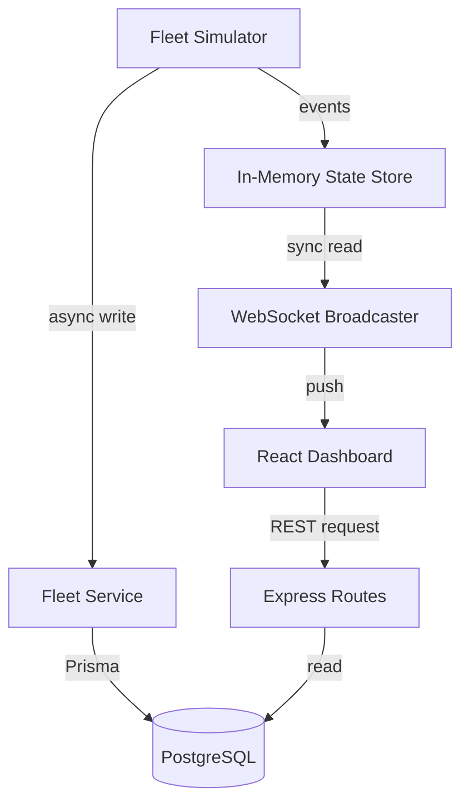

# Architecture

## Overview
This system uses a **Dual-Write Pattern** to achieve both ultra-low latency for the live dashboard and durable historical logging.

## 1. Fleet Simulator (Backend)
- Runs in the Node.js process.
- Ticks every N seconds (configurable).
- Simulates movement, battery drain, and Markov-chain-based status transitions.

## 2. In-Memory State Store
- An ES6 `Map` storing the latest state of each robot.
- Provides O(1) reads for the WebSocket broadcaster.
- Isolates the live dashboard from database latency.

## 3. Database Layer (Prisma + PostgreSQL)
- **Robots Table**: Current state (upserted).
- **RobotEvents Table**: Append-only log of every tick for every robot.
- **TrendSnapshots Table**: Pre-aggregated fleet counts (e.g., 5 Active, 2 Idle) saved periodically to prevent expensive `COUNT(*)` queries on the massive events table.

## 4. Frontend (React + Redux Saga)
- **Canvas Rendering**: The SiteMap uses `requestAnimationFrame` and a `<canvas>` element to draw robots, easily scaling to 1000+ entities without DOM lag.
- **Redux Saga**: Manages the WebSocket connection as a long-running process, handling pings, reconnects, and parsing incoming data streams into Redux actions.
