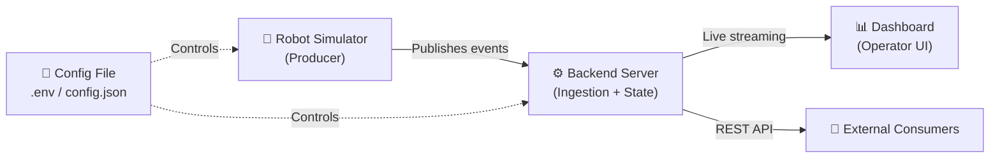
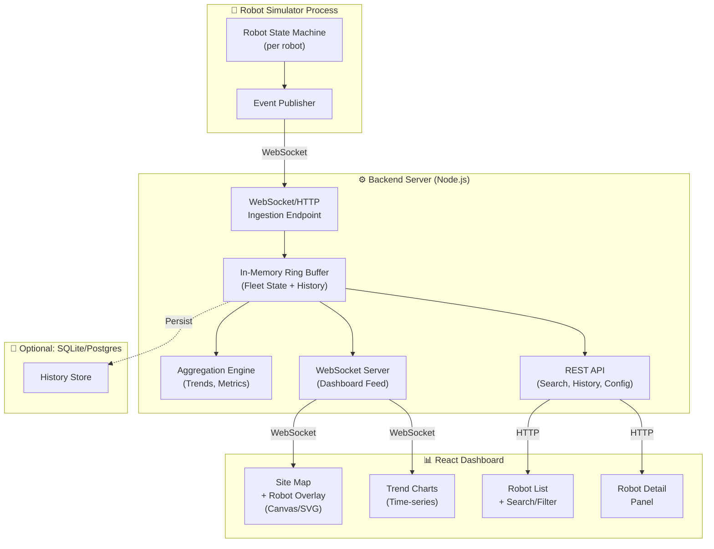
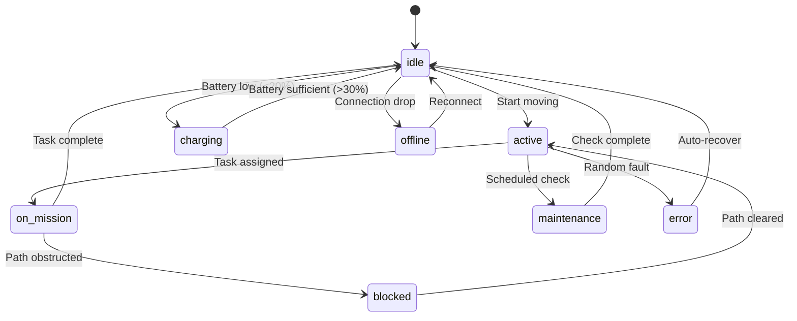
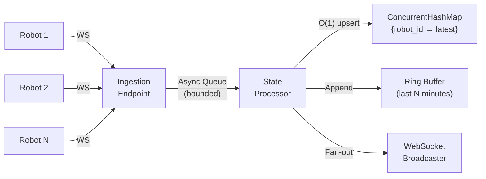
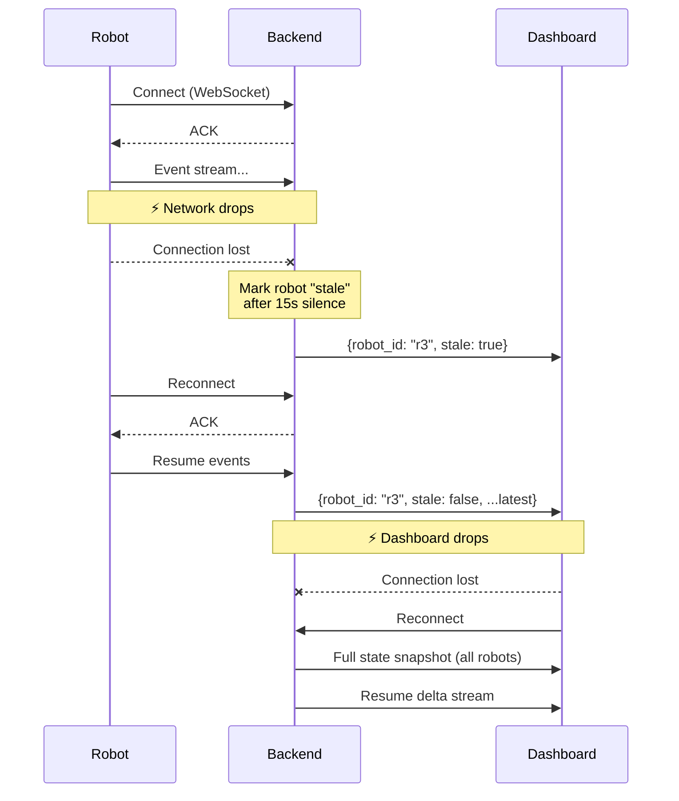
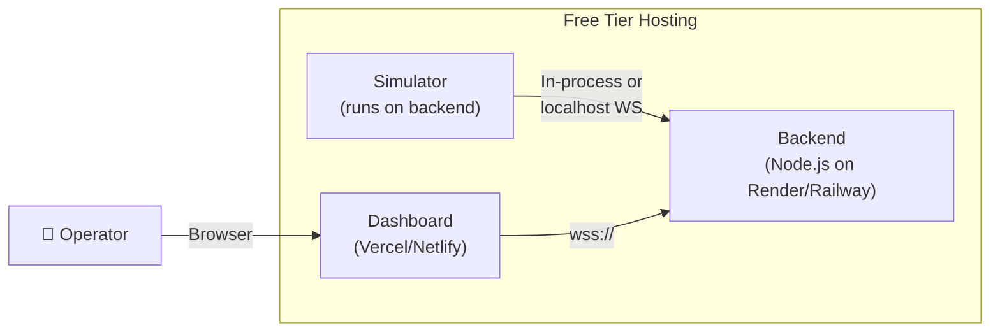
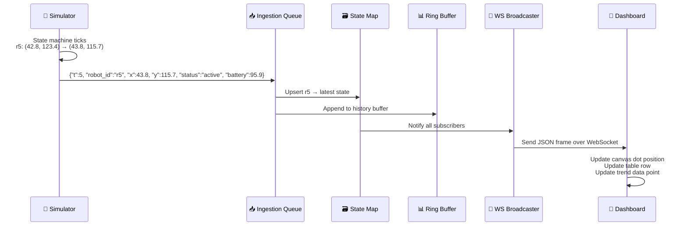

# Fleet Management Dashboard — Architecture & Project Explanation

## What This Project Is

You're building a **real-time fleet management system** — the kind of software a warehouse operator would use to monitor dozens or thousands of autonomous robots moving around a facility. Think of it as a control tower for robots.

The system has **four major pieces** that you must build end-to-end:



---

## Understanding the Data Contract

### The Site — [layout.png](file:///c:/Users/abhis/Peppermint_SDE1_Challenge%20Assignment/layout.png)

- **900×560 pixel** warehouse floor plan
- Origin `(0,0)` is top-left; `x` increases right, `y` increases down (standard image coords)
- 1 pixel = 1 unit of distance (no scale conversion)
- Gray rectangles represent obstacles/shelves/zones the robots navigate around
- Robots must stay within these bounds and not teleport through obstacles

### The Roster — [robots.json](file:///c:/Users/abhis/Peppermint_SDE1_Challenge%20Assignment/robots.json)

| robot_id | robot_type | start_x | start_y |
|----------|-----------|---------|---------|
| r1 | picker | 569.9 | 33.0 |
| r2 | hauler | 787.3 | 65.2 |
| r3 | picker | 382.9 | 35.5 |
| r4 | hauler | 208.0 | 282.8 |
| r5 | picker | 42.8 | 123.4 |
| r6 | hauler | 578.9 | 303.4 |
| r7 | picker | 209.6 | 326.4 |
| r8 | hauler | 716.1 | 23.4 |

- 8 robots, 2 types: `picker` (picks items) and `hauler` (carries heavy loads)
- Starting positions are spread across the site

### The Event Log — [events.jsonl](file:///c:/Users/abhis/Peppermint_SDE1_Challenge%20Assignment/events.jsonl)

- **1,449 lines** covering **t=0 to t=900** (15 minutes)
- Each robot reports every **~5 seconds** → 8 robots × 181 ticks ≈ 1,448 events
- Each event: `{t, robot_id, x, y, status, battery}`
- Rare `task_event` key: found at line 94 (`task_completed`) and line 611 (`task_started`)

### Key Behavioral Patterns Observed

| Behavior | Evidence from Log |
|----------|-------------------|
| **Continuous movement** | r5 moves ~3-10 px per 5s tick, never jumps >15 px |
| **Battery drain while working** | r1 drops from 84.4% → ~47.9% over 900s (~0.04%/s) |
| **Battery charge while charging** | r4 goes from 16.6% → 24.0% in 15s at `charging` status |
| **Stationary when idle/blocked/error** | Position stays fixed when status is non-moving |
| **Status transitions** | `idle → active → on_mission → blocked → idle` (common cycle) |
| **Charging happens at low battery** | r7 enters `charging` at 16.8%, r4 at 16.6% |

### Status Classification (My Design Decision)

| Category | Statuses | Rationale |
|----------|----------|-----------|
| **Working** 🟢 | `active`, `on_mission` | Robot is productively moving/doing tasks |
| **Available** 🔵 | `idle`, `charging` | Robot is available or preparing to be available |
| **Needs Attention** 🟡 | `blocked`, `maintenance` | Not working, operator may need to intervene |
| **Critical** 🔴 | `error`, `offline` | Something is wrong, immediate attention needed |

---

## Proposed Architecture

### High-Level System Diagram



---

### Layer 1: Robot Simulator (Producer)

**Purpose**: Generate fake but realistic robot telemetry.



**Key design decisions**:

| Decision | Choice | Why |
|----------|--------|-----|
| **Movement model** | Smooth interpolation with waypoints | Prevents teleporting; robots pick a target, move toward it at ~2-3 px/tick |
| **Battery model** | Drain ~0.04%/s when moving, ~0.01%/s idle, charge +0.5%/s | Matches the observed data contract |
| **Status transitions** | Weighted random with cooldowns | Prevents unrealistic rapid flapping between states |
| **Bounds checking** | Clamp to site dimensions (0-900, 0-560) | Robots never leave the map |
| **Fleet size config** | `FLEET_SIZE` env var or config.json | Can scale to 1000+ robots; IDs auto-generated |
| **Update interval** | `UPDATE_INTERVAL_MS` env var | Default 5000ms (5s), can go to 100ms |

**Output format** (exact data contract):
```json
{"t": 45, "robot_id": "r5", "x": 20.0, "y": 99.4, "status": "active", "battery": 90.7}
```

---

### Layer 2: Backend Server

**Purpose**: Ingest all robot events, maintain current state, serve dashboard and API consumers.

#### Ingestion Pipeline (Non-Blocking)



> [!IMPORTANT]
> **Why this matters**: The spec says *"a burst of updates or a slow consumer should not stall the pipeline."* This means:
> - Ingestion writes to a **bounded async queue** — if the queue fills, we drop the oldest event (backpressure), not block
> - State storage is a simple `Map<robot_id, LatestState>` — O(1) upsert, no locking contention
> - Broadcasting to dashboards is fire-and-forget per client; a slow dashboard doesn't slow ingestion

#### State Management

| Store | Data | Purpose |
|-------|------|---------|
| **Current State Map** | `{robot_id → {x, y, status, battery, last_seen}}` | Instant snapshot for new dashboard connections |
| **Ring Buffer** | Last 30 min of all events (configurable) | Powers trend charts without a database |
| **SQLite (optional)** | Full history | `GET /robots/history/{robot_id}?from=&to=` |

#### API Surface

| Endpoint | Type | Purpose |
|----------|------|---------|
| `ws://host/ws/fleet` | WebSocket | Real-time updates streamed to dashboards |
| `GET /api/fleet` | REST | Current state of all robots (snapshot) |
| `GET /api/fleet/:id` | REST | Single robot's current state |
| `GET /api/trends` | REST | Aggregated trend data (status distribution over time) |
| `GET /api/config` | REST | Read current config |
| `POST /api/config` | REST | Update fleet size / interval at runtime (auth-protected) |
| `GET /robots/history/:id` | REST | Historical data (stretch goal) |

#### Reconnection Handling



---

### Layer 3: Frontend Dashboard

**Purpose**: Operator's control surface. Must be usable at 8 robots AND 800 robots.

#### Layout

```
┌──────────────────────────────────────────────────────────────┐
│  HEADER: Fleet Overview (total, working, attention, critical)│
├──────────────────────┬───────────────────────────────────────┤
│                      │                                       │
│   SITE MAP           │   ROBOT LIST                          │
│   (Canvas render     │   (Sortable, filterable table)        │
│    of layout.png     │   - Search by ID                      │
│    with robot dots)  │   - Filter by status                  │
│                      │   - Sort by battery                   │
│                      │   - Click → detail panel              │
│                      │                                       │
├──────────────────────┴───────────────────────────────────────┤
│  TREND CHART (stacked area: % of fleet by status over time) │
│  [1min] [5min] [15min] [30min]  ← time window controls      │
└──────────────────────────────────────────────────────────────┘
```

#### Scaling Strategy for the Map

| Fleet Size | Strategy |
|------------|----------|
| 1-50 | SVG circles with labels, smooth CSS transitions |
| 50-500 | HTML Canvas rendering, cluster nearby robots |
| 500+ | Canvas + spatial hashing, only render visible viewport, virtualized list |

> [!TIP]
> The spec explicitly warns: *"A dashboard that looks impressive with eight robots and becomes unusable with eight hundred has missed the point."* The key is rendering on `<canvas>` instead of DOM elements, and virtualizing the robot list.

#### Key Dashboard Features

1. **Live Map**: Robots as colored dots on `layout.png`, color = status category, animated movement
2. **Fleet KPI Bar**: Total robots, % working, % needing attention, average battery
3. **Trend Chart**: Stacked area chart showing fleet status distribution over time, with zoomable time window (1min/5min/15min/30min)
4. **Robot Table**: Searchable, sortable, filterable — click a row to see detail
5. **Detail Panel**: Selected robot's full info: position trail, battery history, status timeline, last seen

---

### Layer 4: Deployment



| Component | Hosting Option | Why |
|-----------|---------------|-----|
| Backend + Simulator | Render / Railway / Fly.io | Free tier, supports WebSockets, persistent process |
| Dashboard | Vercel / Netlify | Free, CDN-backed, instant deploys |
| Database (optional) | SQLite on disk or Supabase free tier | Zero-config persistence |

---

## Data Flow: From Robot Event to Pixel on Screen

Here's the complete journey of a single robot update:



**Total latency target**: <100ms from simulator tick to pixel update.

---

## Failure Scenarios & Handling

| Scenario | What Happens | How We Handle It |
|----------|-------------|-----------------|
| **Robot dies mid-task** | No more events from that robot_id | Backend marks it `stale` after `STALE_TIMEOUT_MS` (default 15s); dashboard shows ⚠️ indicator |
| **Updates arrive late** | Event with older `t` arrives after a newer one | Compare timestamps; only update state if `t > last_seen_t` for that robot |
| **Updates arrive out of order** | t=15 arrives before t=10 | Same timestamp guard; ring buffer stores in arrival order but trend aggregation sorts by `t` |
| **Dashboard drops** | Browser tab sleeps, network blip | On reconnect, backend sends full state snapshot first, then resumes delta stream |
| **Backend restarts** | All in-memory state lost | Simulator reconnects and re-sends; optional SQLite provides warm restart from history |
| **Burst of 1000 robots** | Ingestion queue fills | Bounded queue with backpressure; drop oldest if full; never block the publisher |

---

## Configuration Knobs

| Variable | Default | Where | Description |
|----------|---------|-------|-------------|
| `FLEET_SIZE` | 8 | `.env` / config API | Number of simulated robots |
| `UPDATE_INTERVAL_MS` | 5000 | `.env` / config API | Milliseconds between robot updates |
| `PAYLOAD_SIZE` | `"standard"` | `.env` | `standard` or `extended` (adds extra fields) |
| `STALE_TIMEOUT_MS` | 15000 | `.env` | Time before marking a robot as stale |
| `HISTORY_WINDOW_S` | 1800 | `.env` | Seconds of history to keep in ring buffer |
| `PORT` | 3001 | `.env` | Backend server port |
| `AUTH_TOKEN` | (random) | `.env` | Token for config API (basic security) |

> [!IMPORTANT]
> Fleet size and update interval must be changeable at runtime via the `POST /api/config` endpoint **without redeploying**. This endpoint is protected by `AUTH_TOKEN`.

---

## Tech Stack Recommendation

| Layer | Technology | Why |
|-------|-----------|-----|
| Simulator | Node.js (same process or separate) | Shares language with backend, easy WebSocket client |
| Backend | **Node.js + Express + ws** | Non-blocking I/O, native WebSocket support, lightweight |
| Dashboard | **React + Vite** | Fast builds, component model for complex UI |
| Charts | **Recharts** or **Chart.js** | Time-series with zoom controls |
| Map Rendering | **HTML Canvas API** | Scales to thousands of dots without DOM overhead |
| Database | **SQLite** (via better-sqlite3) | Zero-config, embedded, good enough for single-server |
| Deployment | **Render** (backend) + **Vercel** (frontend) | Free tiers, WebSocket support on Render |

---

## What Gets Graded (and Where to Focus)

| Aspect | Weight | What They're Looking For |
|--------|--------|------------------------|
| **Plausible simulation** | High | Smooth movement, realistic battery, sensible status transitions |
| **Non-blocking ingestion** | High | Backend doesn't lock up under load |
| **Dashboard as a product** | High | Usable at 8 AND 800 robots, readable, well-laid-out |
| **Trend visualization** | Medium | At least one live trend with time window controls (not just a counter) |
| **Reconnection handling** | Medium | Graceful recovery for robots and dashboards |
| **Config without redeploy** | Medium | Runtime adjustment of fleet size + interval |
| **FINDINGS.md quality** | High | Real tradeoffs with real numbers, not theoretical |
| **ARCHITECTURE.md** | Medium | Clear diagram + narrative of data flow + failure handling |
| **Tests** | Low-Med | Tests for the trickiest part (you pick what) |
| **History API** | Optional | Stretch goal, bonus points |

---

## Project File Structure (Proposed)

```
fleet-management/
├── simulator/
│   ├── robot.js              # Robot state machine (movement, battery, status)
│   ├── fleet.js              # Fleet manager (spawns N robots, manages lifecycle)
│   ├── publisher.js          # Publishes events to backend via WebSocket
│   └── config.js             # Reads FLEET_SIZE, UPDATE_INTERVAL_MS, etc.
├── backend/
│   ├── server.js             # Express + WebSocket server entry point
│   ├── ingestion.js          # Async queue, event processing
│   ├── state.js              # In-memory fleet state (Map + Ring Buffer)
│   ├── routes/
│   │   ├── fleet.js          # GET /api/fleet, GET /api/fleet/:id
│   │   ├── trends.js         # GET /api/trends
│   │   ├── config.js         # GET/POST /api/config
│   │   └── history.js        # GET /robots/history/:id (optional)
│   ├── ws.js                 # WebSocket broadcaster (fan-out to dashboards)
│   └── db.js                 # SQLite setup (optional)
├── dashboard/
│   ├── src/
│   │   ├── App.jsx
│   │   ├── components/
│   │   │   ├── SiteMap.jsx        # Canvas-rendered map with robot dots
│   │   │   ├── FleetKPIBar.jsx    # Summary stats
│   │   │   ├── TrendChart.jsx     # Time-series trend with zoom
│   │   │   ├── RobotTable.jsx     # Searchable, filterable list
│   │   │   └── RobotDetail.jsx    # Detail panel for selected robot
│   │   ├── hooks/
│   │   │   └── useFleetSocket.js  # WebSocket connection + reconnect logic
│   │   └── utils/
│   │       └── statusColors.js    # Status → color mapping
│   └── public/
│       └── layout.png             # Site map image
├── .env.example
├── config.json
├── README.md
├── FINDINGS.md
├── ARCHITECTURE.md
├── Dockerfile (optional)
└── package.json
```
